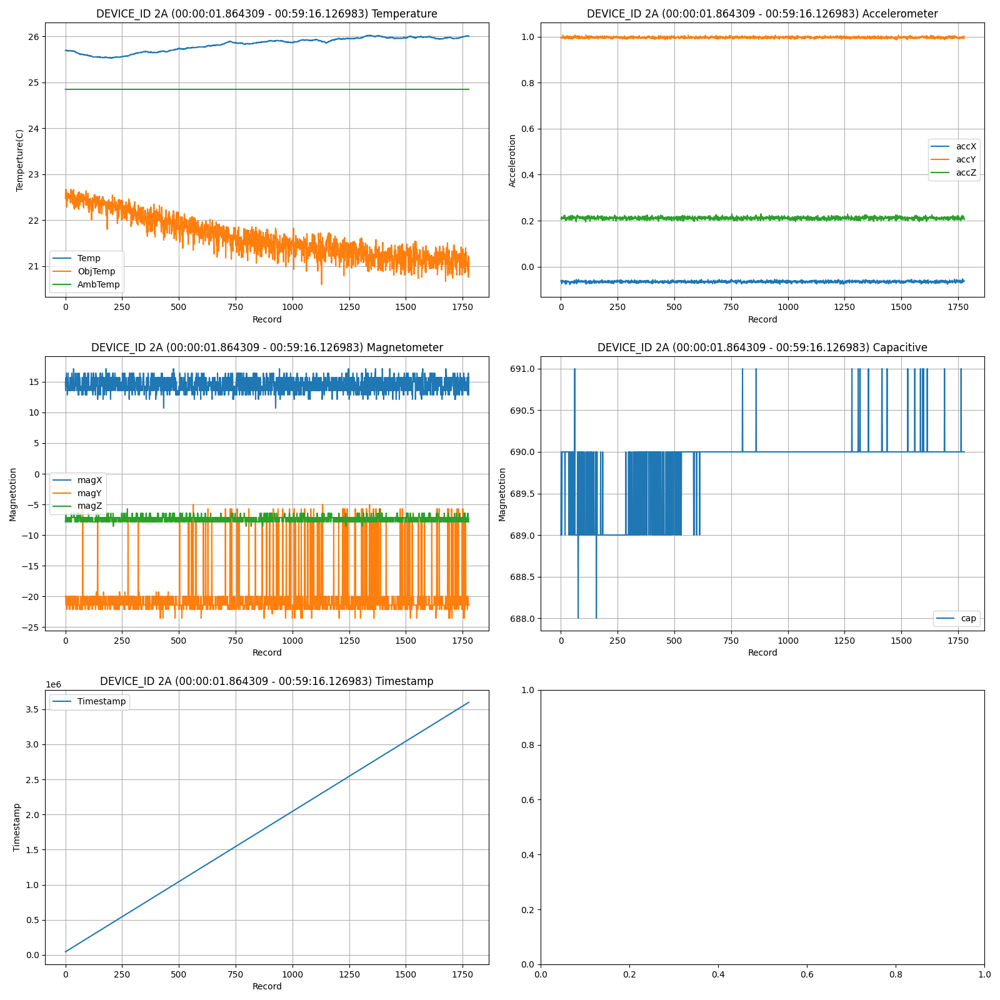
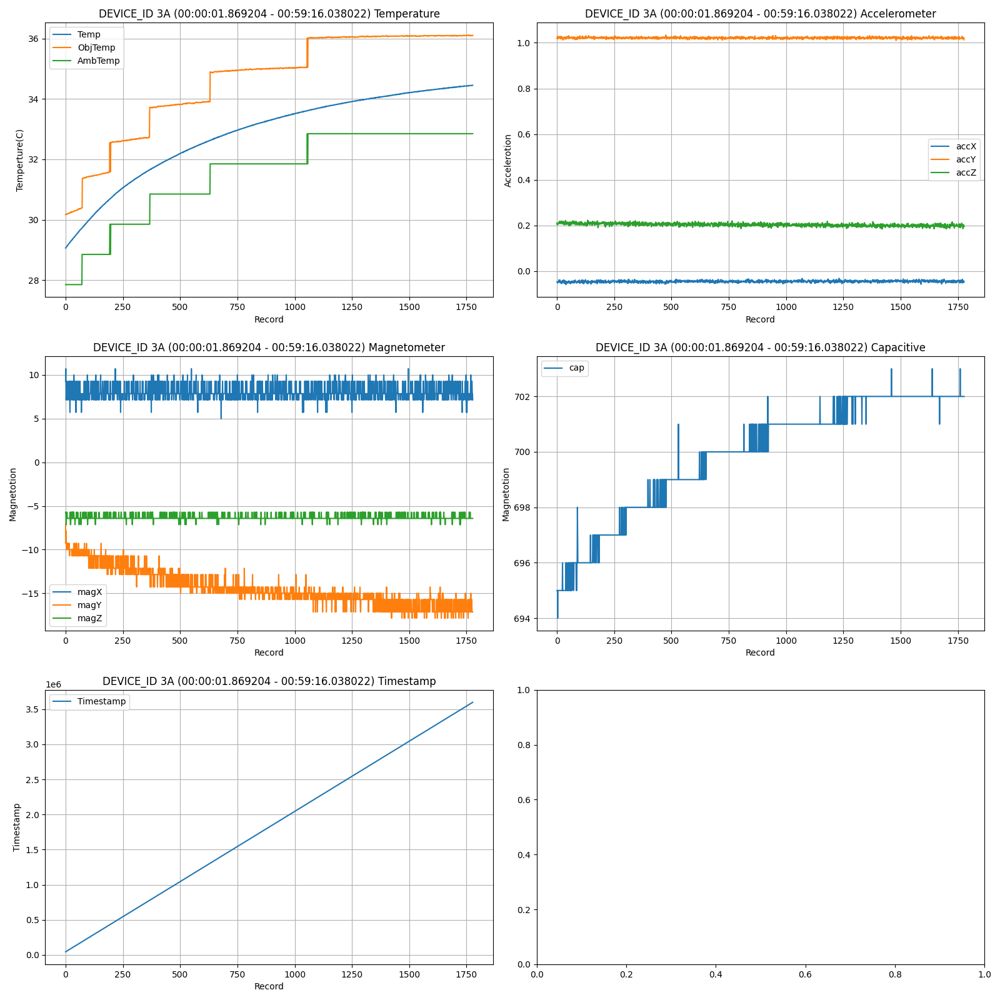
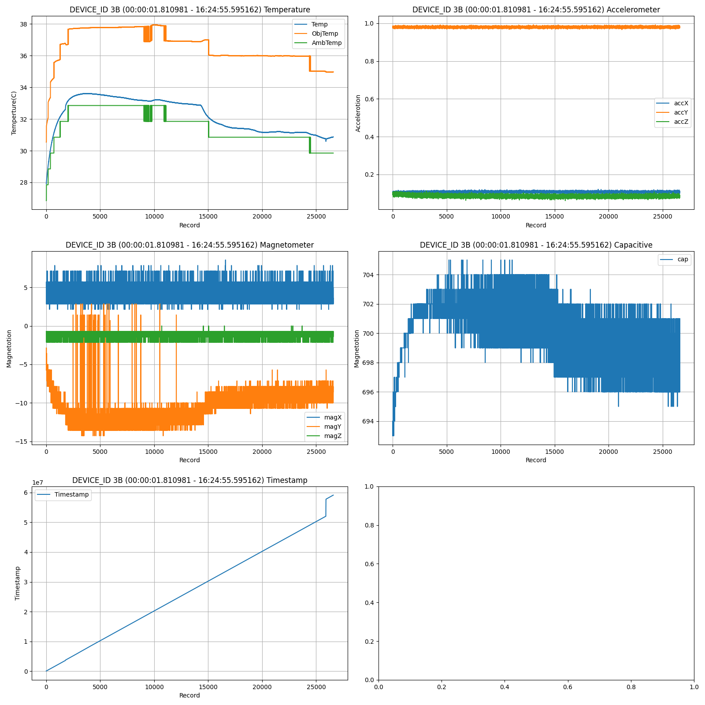
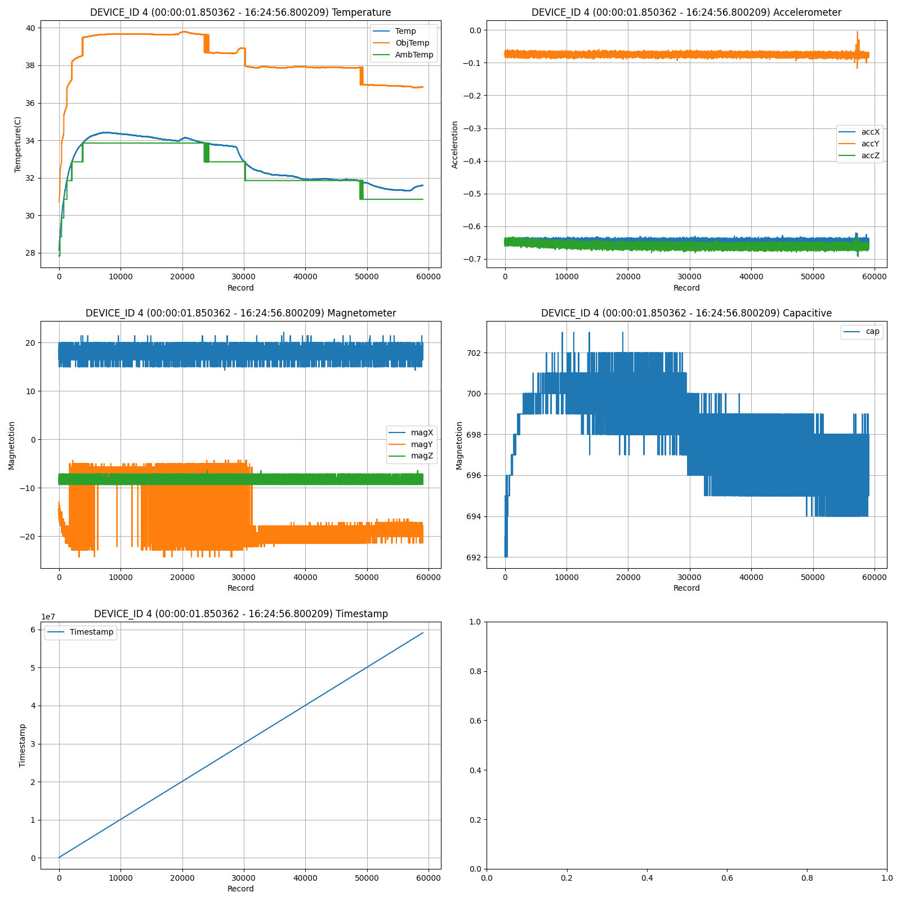

## Project Description
[View the PDF file](doc/HASP_AHAC_June11_v061611.pdf)  
Raspberry Pi works as the master, collecting data from 8 Arduino slave devices.  

## Usage
- ### Hardware
    - Raspberry Pi, Arduino
    - Protocl
        - I2C, UART, SPI
    - RF
        - LoRa
- ### Software
    - python, C++
    - threading, logging, serial
    - numpy, pandas, matplotlib.pyplot
## Data graphs
<picture>

</picture>
