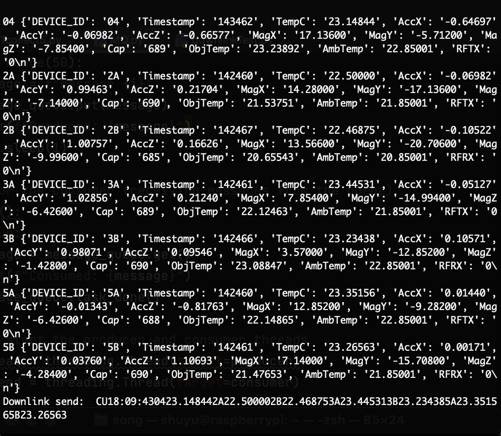

## [Project Description](https://laspace.lsu.edu/hasp/documents/presentations/HASP_AHAC_June11_v061611.pdf)
- [HASP Webiste](https://laspace.lsu.edu/hasp/)  
- [HASP Description](https://laspace.lsu.edu/hasp/documents/presentations/HASP_AHAC_June11_v061611.pdf)  
- [Project Documents](/doc/HASP_AHAC_June11_v061611.pdf)  

Raspberry Pi works as the master with failover and logging, collecting data from 8 Arduino slave devices.  

## Usage
- ### Hardware
    - Raspberry Pi, Arduino
    - Protocl
        - I2C, UART, SPI
    - RF
        - LoRa
- ### Software
    - python, C++
    - threading, logging, serial
    - numpy, pandas, matplotlib.pyplot
- ### Features
    - Mulithreading
    - Logging events
    - Clock synchronization with Real Time Clock
    - Port Scan add and remove threads
    - RF Communication
    - Serial Communication

## Screenshots
<picture>

</picture>

## Data graphs
<picture>

</picture>
<picture>

</picture>
<picture>

</picture>
<picture>

</picture>
